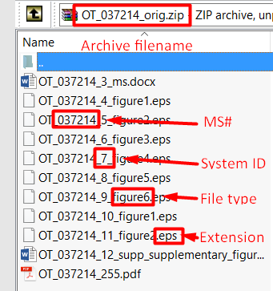
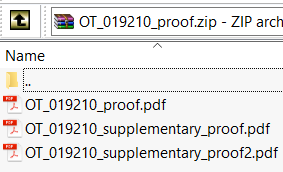
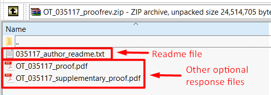

Composition
===========

Composition is a group of tasks that are arranged together to achieve
the goals of creating the page proofs and obtaining feedback on these
proofs from the manuscript’s authors.
  
Video: Author proofing
-------------------------------
.. raw:: html

	<iframe width=640 height=392 frameborder="0" scrolling="no" src="https://screencast-o-matic.com/embed?sc=cbQrrFIZ6F&v=5&ff=1" allowfullscreen="true"></iframe>

	
Export files for initial proof
-------------------------------

**Role:** `System <roles.html#system>__

This is an automated system task during which JPS gathers the files
transferred from the submission system, organizes them into an
archive, and notifies the composition vendor assigned to the article
in the `Assign to vendor <assigntovendor.html>`__ task that the page
proofs need to be prepared. The files will be packaged together in a
ZIP archive named as follows: OT_[MS#]_orig.zip

The following files are supplied to the vendor if present in the
original accepted submission:
  
 - Article/Source = OT_[MS#]_[ID]_ms.doc/docx
 - Figures/Source = OT_[MS#]_[ID]_figure1.ext
 - Tables/Source = OT_[MS#]_[ID]_table1.ext
 - Supplemental material/Source = OT_[MS#]_[ID]_supp1.ext
 - Video/Source = OT_[MS#]_[ID]_video.ext
 - Dataset/Source= OT_[MS#]_[ID]_dataset1.ext
 - Merged PDF = OT_[MS#]_[ID].pdf

 .. note:: [MS#] is the six-digit manuscript number assigned by the submission system. Revision markers (R1, R2) are not included in this number. [ID] is a sequential identifier assigned to each file in the package, it can be ignored.

Here are the contents of a typical file package:

|image0|

After JPS successfully exports the file package to the FTP
server, it will notify the composition vendor that the article is
ready for the page proofs. The Awaiting import – initial proof task
will open automatically.

Awaiting import - initial proof
-------------------------------

**Role:** `Vendor <roles.html#vendor>`__

During this task, the system waits for the composition vendor to upload the
prepared page proofs to the FTP so that it can pass them on to the
authors. The vendor prepares the PDF page proofs for the main article
and any supplementary files that may be present. To ensure the
successful import of the page proofs, the files must be named as
follows:
  
 - article proof = OT_[MS#]_proof.pdf
 - first supplementary materials proof (if present) = OT_[MS#]_supplementary_proof.pdf
 - Any additional supplementary materials proofs (if present) = OT_[MS#]_supplementary_proof[ID].pdf

.. note:: [ID] is a sequential number of the supplementary proof file, starting with 2. So, if an article requires three PDF supplementary proof files, the ID will be 2 for the second file and 3 for the third file.

All of these PDF files must be zipped together with the archive named as follows:

 - OT_[MS#]_proof.zip
 
Here’s an example of a typical package containing author proofs:

|image1|

The vendor then uploads the complete package to the JPS FTP.
Upload directory: 
 
 - /home/JPS/To_JPS

.. note:: For the current FTP credentials, please contact the production manager.

During this task, the vendor has an option to open a query to the
authors via the Send email interface.
After the proofs import successfully, the author will be notified and
the Author proof review task will open.

Author proof review
-------------------------------
**Role:** `Author <roles.html#author>`__

During the author proof review task, the authors have a chance to
review the page proofs produced by the composition vendor and to make corrections. After the system imports the page proof package
uploaded by the vendor, it will open a query to the authors. They will be asked to review each of the page proof files and
to provide their comments. Alternatively, authors have the option to sign
off on the proofs without requesting any corrections.

Export files for revised proof
-------------------------------
**Role:** `System <roles.html#system>`__

This is, once again, an automated task. After the authors complete the
proof review task, JPS will check the status of the Awaiting license
to publish task. If the task is not complete, the system will continue
checking and reminding the authors about the outstanding
license/author agreement.

.. warning:: The workflow will not proceed to the next task until the `Awaiting license to publish <license.html>`__ task is completed.

Once the Awaiting license to publish task is completed (or immediately,
if it was completed at an earlier point), JPS will process and package
the author proof response and then upload it to the FTP. When upload is finished, JPS will notify the vendor and open the `ePub
in OJS <epub.html>`__ task. At this point, the Composition process is finished.

The response files will be in the following directory:

 - /home/JPS/From_JPS
 
The files will be packaged in a ZIP archive and named as follows:

 - OT_[MS#]_proofrev.zip
 
Inside the package, there will be a readme file containing the response text entered by the author, along with any other files that they chose to include with
their proof revisions.

Here’s a typical proof response package:

|image2|

